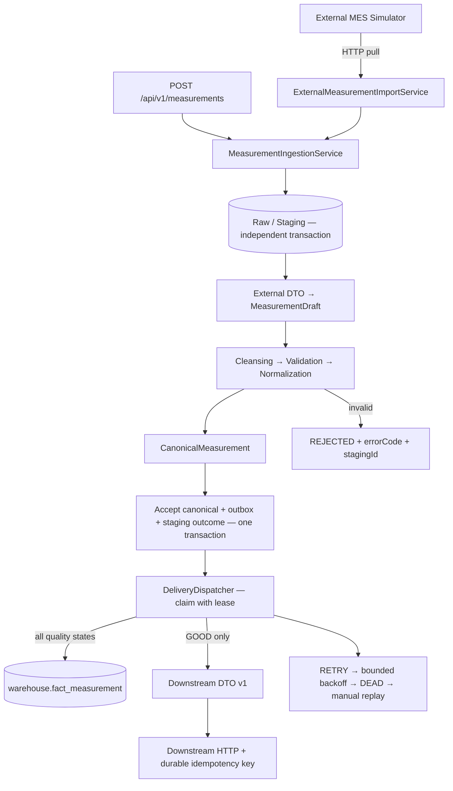

# FactoryBridge
### Manufacturing Data Integration Middleware

給資深軟體工程師二次面試展示的製造業資料整合 Demo。以設備量測為主題，展示從外部 MES、原始資料留存、驗證與清洗，到標準化、資料倉儲與下游交付的完整流程。

**閱讀重點：來源格式有邊界、失敗有證據、接收有交易、重送有規則。** 這是模擬企業整合的可執行專案；不宣稱為真實工廠系統，也不把「HTTP 接收成功」當成「所有系統已同步」。

## 先執行

只需要可運作的 Docker Engine 與 Docker Compose v2。macOS Apple Silicon 可用 Docker Desktop 或 Colima；映像支援 Linux ARM64，不強制模擬 x86。

```sh
git clone https://github.com/xuping68/FactoryBridge-Manufacturing-Data-Integration-Middleware.git
cd FactoryBridge-Manufacturing-Data-Integration-Middleware
docker compose up
```

第一次啟動會建置 Java 程式並執行不需 Docker daemon 的測試。看到 app healthy 後即可操作。若修改過程式，改用：

```sh
docker compose up --build --wait
python3 demo/smoke-test.py
```

- [Swagger UI](http://localhost:8080/swagger-ui/index.html)｜[OpenAPI JSON](http://localhost:8080/v3/api-docs)
- [Readiness](http://localhost:8080/actuator/health/readiness)｜[模擬下游接收紀錄](http://localhost:8090/admin/deliveries)
- PostgreSQL：localhost:5432，database/user：`factorybridge`，Demo password：`factorybridge_demo`。

Compose 啟動 app、PostgreSQL、MES／下游模擬器。host port 僅綁定 loopback；raw 查詢、故障開關與 replay 是本機展示功能，沒有生產環境的身分驗證。所有範例都是合成資料。

## 五分鐘看懂主要流程



建議依這個順序閱讀：

| 順序 | 檔案 | 看什麼 |
| --- | --- | --- |
| 1 | [MeasurementIngestionService](src/main/java/io/factorybridge/application/MeasurementIngestionService.java) | 小型流程協調；不自己做 HTTP、SQL、單位轉換 |
| 2 | [MeasurementNormalizer](src/main/java/io/factorybridge/domain/MeasurementNormalizer.java) | 純 Java 的清洗、驗證與 canonical 建立 |
| 3 | [JpaMeasurementStore](src/main/java/io/factorybridge/adapter/persistence/JpaMeasurementStore.java) | 原子去重與 canonical/outbox 交易 |
| 4 | [DeliveryDispatcher](src/main/java/io/factorybridge/application/DeliveryDispatcher.java) | 交付與 acknowledgement 的失敗邊界 |
| 5 | [JdbcDeliveryStore](src/main/java/io/factorybridge/adapter/persistence/JdbcDeliveryStore.java) | SKIP LOCKED、lease token 與安全重跑 |
| 6 | [HTTP adapters](src/main/java/io/factorybridge/adapter/http) | 來源 DTO、下游 DTO、有限超時與錯誤分類 |
| 7 | [測試](src/test/java/io/factorybridge) | 用可驗證的失敗情境支持設計，而非只測 happy path |

## 一筆量測的變化

原始資料以字串表示 value、unit、eventTime；其中來源設備、製程位置、批號與品質都有獨立意義。完整輸入見 [measurement.json](demo/fixtures/measurement.json)。

```sh
curl -i http://localhost:8080/api/v1/measurements \
  -H 'Content-Type: application/json' \
  -H 'X-Correlation-Id: interview-001' \
  --data-binary @demo/fixtures/measurement.json
```

首次回傳 `202 ACCEPTED`，附上 `measurementId`、`stagingId` 與 `deliveriesUrl`。依 `Location` 查到的 canonical 內容包含：

```json
{
  "equipmentId": "EQ-CT-003",
  "plantCode": "KH01",
  "lineCode": "CELL-LINE-01",
  "stationCode": "COATING-03",
  "lotNumber": "LOT-20260910-0012",
  "metricType": "TEMPERATURE",
  "numericValue": 35.200000,
  "standardUnit": "C",
  "measuredAt": "2026-09-10T06:30:22Z",
  "qualityStatus": "GOOD",
  "source": "MES_A",
  "sourceRecordId": "MES-A-20260910-000001"
}
```

這是 canonical 欄位節錄；API 另附 id、equipmentType、batchNumber 與 createdAt。計算使用 BigDecimal；`(95.36 − 32) × 5 ÷ 9 = 35.2°C`。

| 原始規則 | Canonical 規則 |
| --- | --- |
| TEMP / TEMPERATURE，C / F | TEMPERATURE，C |
| PRESSURE，Pa / kPa / bar | PRESSURE，kPa；此 Demo 定義為絕對壓力 |
| HUMIDITY，% | HUMIDITY，%，0–100 |
| RPM / ROTATIONAL_SPEED，RPM | ROTATIONAL_SPEED，rpm |
| OK / PASS / GOOD | GOOD，投遞 DWH 與 downstream |
| WARN / WARNING；NG / FAIL / BAD | WARNING / BAD，僅投遞 DWH |

識別碼去除首尾空白；來源、設備、廠區等代碼轉大寫。sourceRecordId、lotNumber、batchNumber 保留大小寫。未知單位、未知品質、無法解析的數值一律拒絕，不猜測、不偷偷修補。

時間接受帶 offset 的 ISO timestamp，或來源約定的 `uuuu/MM/dd HH:mm:ss`：MES_A 使用 Asia/Taipei，MES_B 使用 UTC。不得依賴伺服器預設時區；限制年份 2000–2100，嚴格拒絕不存在的日期。資料庫存 Instant/timestamptz，精度截斷到微秒。

數值統一 scale 6、HALF_UP，對應 PostgreSQL numeric(20,6)；禁止千分位、科學記號與 NaN。溫度不可低於絕對零度；絕對壓力與轉速不可為負。設備實際上下限與製程 alarm threshold 應由後續規格／recipe 管理，這裡不硬編造工廠規則。

## 重送、失敗與復原

| 情境 | 系統行為 |
| --- | --- |
| 相同 source + sourceRecordId、相同 JSON 內容 | 200，回傳原 measurementId；新增本次 staging，沒有新 canonical/outbox |
| 相同 source key、不同內容 | 409 DUPLICATE_SOURCE_RECORD；不覆寫已接受量測 |
| JSON 欄位順序或排版不同 | 相同 fingerprint；識別不受排版影響 |
| 字串值、未知欄位或陣列順序改變 | fingerprint 會改變；清洗後剛好一樣仍不代表原內容一樣 |
| malformed JSON／無效數值／單位 | raw 保留，REJECTED，回傳 stagingId 與語意錯誤 |
| 超過 64 KiB／非法 UTF-8 | transport 邊界拒絕，沒有 staging；防止無限制記憶體或不保真的字元替換 |
| 接收交易失敗 | canonical 與 outbox 一起回滾；已提交的 raw 留存 |
| 下游 503／timeout／429 | durable RETRY，指數退避加 jitter；失敗回報時依本輪認領次數評估 5 次門檻 |
| 下游不可重試的 4xx／程式契約缺陷 | DEAD，人工排查後 replay |
| 送出成功但未記下成功結果 | lease 過期後重送同一 idempotency key；接收端須原子去重 |
| 匯入回傳了另一筆來源識別 | EXTERNAL_RECORD_MISMATCH 隔離；禁止以 raw replay 繞過，需重新 import |
| app 重啟／多 worker | DB 原子 claim + SKIP LOCKED；過期租約可回收，舊 token 不可覆寫新狀態 |

認領後反覆崩潰或 acknowledgement 無法提交時，claim 次數可能超過門檻；詳細邊界見 [重試決策](docs/decisions.md)。

語意是 **at-least-once delivery**。下游模擬器將 idempotency key 與接收紀錄在 SQLite 同一交易寫入；DWH 以 measurementId 唯一鍵與 INSERT ON CONFLICT DO NOTHING 去重，不覆寫既有 fact。這證明在合作接收端的契約下可避免重複副作用，並非跨系統全域 exactly-once。

raw replay 產生新的 staging，不修改歷史。相同 key 已成功接受的資料如果需要更正，來源應發出新識別或另設明確 revision 契約；本版不提供偷偷覆寫的 update API。

MES 匯入的預期 source identity 與 raw 在最初同一交易留存；即使程式在驗證前崩潰、staging 仍為 RECEIVED，重跑也必須沿用原來的來源識別檢查。

## API 與錯誤契約

| Method / path | 責任 |
| --- | --- |
| POST /api/v1/measurements | 接收一筆原始量測 |
| POST /api/v1/imports | 依 sourceSystem、sourceRecordId 從 MES 取得資料 |
| GET /api/v1/measurements?limit=20 | 查最近量測；limit 1–100，依建立時間/id 倒序 |
| GET /api/v1/measurements/{id} | 查 canonical |
| GET /api/v1/measurements/{id}/deliveries | 查各目的地交付狀態 |
| GET /api/v1/staging/{id} | 查 raw 與處理結果 |
| POST /api/v1/staging/{id}/replays | 以同 raw 建立新的處理嘗試 |
| GET /api/v1/deliveries/{id} | 查重試、錯誤與累計嘗試 |
| POST /api/v1/deliveries/{id}/replays | 只允許 DEAD 重新排隊，保留 delivery ID |

```json
{
  "errorCode": "UNSUPPORTED_UNIT",
  "category": "VALIDATION",
  "message": "Measurement unit is not supported for this metric.",
  "correlationId": "interview-001",
  "timestamp": "2026-09-10T06:30:22Z",
  "stagingId": "b65fce5a-84e1-4700-926d-02d6c3fd6aef",
  "violations": []
}
```

訊息可補充情境，呼叫端應依穩定 errorCode 分支。Validation 使用 400（格式／參數）或 422（量測語意）；Business 使用 404/409；Integration 使用 502/503；Infrastructure 使用 503 或意外缺陷的 500。回應不包含 SQL、密碼或 stack trace。完整代碼見 [ErrorCode](src/main/java/io/factorybridge/domain/ErrorCode.java)。

X-Correlation-Id 僅接受 1–64 個安全字元，否則產生新 UUID。API response header、staging、outbox 與交付 log 可串聯；HTTP request log 不記錄 raw 或 operatorId。

## 工程設計

採單一 Maven 專案、以 package 分責任。Domain 與 application 不依賴 Spring、Jackson、HTTP 或資料庫；有實際變動來源才抽 port。

- **Domain**：immutable records、單位／數值／時間政策；純 Java 可直接測試。
- **Application**：接收、匯入、重跑、投遞協調；Clock／retry jitter 可注入。
- **Adapters**：不同來源／下游 DTO、JPA entity、HTTP API response 分離。
- **Persistence**：JPA 做生命週期與讀取；PostgreSQL 原子去重／lease 用明確 SQL。Flyway 管 schema，Hibernate 僅 validate，關閉 Open Session in View。
- **Delivery**：網路 I/O 不持有 DB row lock。DWH 與 downstream 分開追蹤；每次只認領一筆，避免批次後段等待時 lease 已過期。
- **Operations**：有限 timeout、bounded request body、非 root container、readiness 含 DB、優雅停止、CI 與可重跑 smoke checks。

[架構與交易邊界](docs/architecture.md)｜[設計決策與取捨](docs/decisions.md)｜[面試展示步驟](demo/README.md)｜[驗證紀錄](docs/verification.md)｜[面試官 Review](docs/interviewer-review.md)

## 測試與建置

本機開發需要 **Java 21**；Maven Wrapper 固定 3.9.11 並校驗下載檔。完整 verify 另需 Docker daemon。Java 相依固定為 Spring Boot 3.5.16、Springdoc 2.8.17，採 JUnit 5／Mockito／Testcontainers；版本相容性依 [Spring Boot requirements](https://docs.spring.io/spring-boot/3.5/system-requirements.html) 與 [Springdoc compatibility](https://springdoc.org/#what-is-the-compatibility-matrix-of-springdoc-openapi-with-spring-boot) 確認。

```sh
./mvnw test                       # domain/application/API/HTTP contract/architecture
./mvnw verify                     # 再加真正 PostgreSQL 的 Testcontainers IT
./mvnw spotless:check             # 一致的 Java 格式
./mvnw spotless:apply             # 主動整理格式
python3 -m unittest discover -s demo -p 'test_*.py' -v
```

`verify` 在 Docker 不可用時會失敗，不會略過整合測試再印成功。CI 執行 verify、格式檢查、模擬器測試、Compose 啟動與完整 smoke test。報告輸出在 target/surefire-reports、target/failsafe-reports、target/site/jacoco。

若使用 Colima 且 Testcontainers 無法自動找到 socket：

```sh
export DOCKER_HOST="unix://${HOME}/.colima/default/docker.sock"
export TESTCONTAINERS_DOCKER_SOCKET_OVERRIDE=/var/run/docker.sock
./mvnw verify
```

## Demo 邊界與下一步

本版刻意聚焦可讀、可驗證的單筆整合流程：沒有批次匯入、訊息 broker、分散式全域交易、依設備排序保證或完整資料倉儲星型模型。最近量測查詢是 bounded recent list，尚未提供大量資料的 cursor pagination。

DWH 與 operational store 共用一個 PostgreSQL cluster、使用不同 schema 與交易；這讓 Demo 可一鍵執行，也代表不是獨立 failure domain。WarehouseWriter 已隔離，換成另一座 DB 或 API 不需改 domain。

正式導入前應依場域需求補上來源身分驗證、replay 權限與操作者稽核、raw 保留／遮罩政策、DB 帳號最小權限、dead/backlog 告警、容量與壓力測試、設備／recipe 規格、mapping 版本遷移與接收端冪等協議。這些是已辨識的交付界線，不是宣稱已完成的功能。
