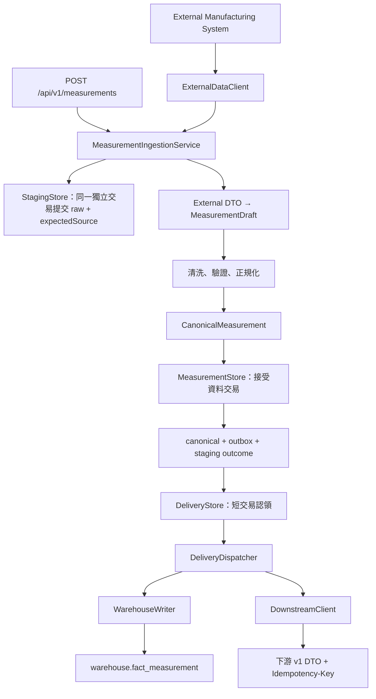
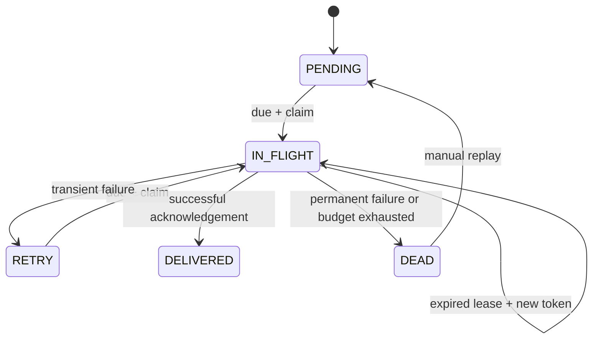

# FactoryBridge 架構與資料生命週期

FactoryBridge 將「接受一筆量測」與「送達各目的地」分開。API 回覆 `202 Accepted` 時，canonical、outbox 與 staging 成功狀態已一起提交；warehouse 或 downstream 的成功由 delivery 狀態另外表示。這個邊界避免把下游暫時故障變成資料遺失，也避免在資料庫交易內等待 HTTP。

## 1. 閱讀主要流程

建議從以下檔案依序閱讀；每個類別處理一個變動來源或一個清楚的流程邊界。

| 閱讀入口 | 責任 |
|---|---|
| [MeasurementController](../src/main/java/io/factorybridge/adapter/web/MeasurementController.java) | HTTP 收件、狀態碼、對外 response；不處理單位換算或 DB 交易 |
| [MeasurementIngestionService](../src/main/java/io/factorybridge/application/MeasurementIngestionService.java) | 串接 raw 與來源請求條件留存、解碼、識別核對、正規化與接受資料 |
| [JacksonMeasurementPayloadDecoder](../src/main/java/io/factorybridge/adapter/http/external/JacksonMeasurementPayloadDecoder.java) | 外部 JSON 契約、嚴格型別檢查與 payload fingerprint |
| [MeasurementNormalizer](../src/main/java/io/factorybridge/domain/MeasurementNormalizer.java) | 純 Java 的清洗、驗證、時間與量測標準化 |
| [JpaMeasurementStore](../src/main/java/io/factorybridge/adapter/persistence/JpaMeasurementStore.java) | canonical 去重、outbox 建立與 staging 更新的單一交易 |
| [DeliveryDispatcher](../src/main/java/io/factorybridge/application/DeliveryDispatcher.java) | 認領 delivery、呼叫目的地 port、依錯誤分類排程重試 |
| [JdbcDeliveryStore](../src/main/java/io/factorybridge/adapter/persistence/JdbcDeliveryStore.java) | PostgreSQL 認領、lease fencing 與 delivery 狀態轉移 |



## 2. 依賴方向與模型邊界

`domain` 不依賴 Spring、JPA、HTTP client 或 JSON library。`application` 使用 domain 與自己定義的 port；`adapter` 實作這些 port。Spring wiring 集中於 `config`。

```text
HTTP / scheduler adapter → application → domain
                               ↓
                         application port
                               ↑
                  HTTP / persistence adapter
```

資料模型各自有不同用途：

| 模型 | 用途與變更邊界 |
|---|---|
| `ExternalMeasurementDto` | 來源 wire format，保留 `productionLine`、字串 `value`、來源時間等欄位 |
| `MeasurementDraft` | 解碼後、尚待驗證的原始量測語意，沒有 JSON annotation |
| `CanonicalMeasurement` | 不可變的標準量測；使用 `BigDecimal`、`Instant`、`MetricType`、`QualityStatus` |
| `SourceRecordIdentity` | import 原請求的 source system / record ID，以 staging `expectedSource` 保存；push 為 null |
| `MeasurementEntity` / `StagingEntity` | 僅存在 persistence adapter 的 JPA 結構 |
| `DownstreamMeasurementDto` | 下游 schema version 1 的巢狀 asset、measurement、traceability 格式 |
| API response records | 對外資源呈現，delivery response 不暴露內部 lease token |

`operatorId`、來源 `receivedAt` 與 `metricName` 留在 raw，未成為 canonical 欄位。FactoryBridge 自己記錄的 staging `receivedAt` 才是實際收件時間。

## 3. 交易邊界

| 操作 | 交易範圍 | 失敗後的結果 |
|---|---|---|
| `recordReceived` | 同一 `REQUIRES_NEW` 交易保存 UTF-8 raw 與 `expectedSource` | 成功後即使尚未寫 outcome 就中斷，原文與 import 請求條件仍一起保留 |
| 解碼、驗證、正規化 | 不開 DB 交易 | 不產生 canonical 或 delivery |
| `acceptMeasurement` | 同一 operational DB 交易：canonical、outbox、staging | 任一 SQL 或 commit 失敗時全部回滾 |
| `recordRejection` | `REQUIRES_NEW`，只更新 `RECEIVED` | 不覆蓋 `ACCEPTED` / `DUPLICATE`；若稽核更新也失敗，保留原始錯誤並附加 suppressed cause |
| `claimDueDeliveries` | 短交易，`FOR UPDATE SKIP LOCKED` | 每筆認領取得新 token，提交後才做 I/O |
| HTTP 下游送件 | 不持有 DB 交易 | 依持久化 delivery 狀態重試 |
| `writeMeasurement` | warehouse 獨立交易 | 與 operational acknowledgement 分開，故須容忍重送 |
| `markDelivered` / `markFailed` | 短交易，比對 delivery ID、`IN_FLIGHT` 與 lease token | 舊 worker 的遲到結果不會覆寫新 worker 的狀態 |

Flyway history 固定放在 `public` schema；PostgreSQL 預設搜尋路徑含 `$user`，若不固定，首次 migration 建立與帳號同名的 `factorybridge` schema 後，下次啟動可能到不同位置找 history。此修正不使用 baseline，也不刪除既有資料。

`PersistenceTransactions` 使用 `TransactionTemplate`，捕捉範圍包括 commit。底層 DB 例外保留為 cause，對 application 轉為 `INFRASTRUCTURE_UNAVAILABLE`；warehouse 轉為 `DATA_WAREHOUSE_WRITE_FAILED`。

API body 先受大小與 UTF-8 邊界限制，通過後才進入 raw 留存。raw 使用 `bytea` 保存有效 UTF-8 原文，包含實際 NUL 字元造成的無效 JSON；API 查詢仍回傳字串。超出請求邊界的資料不會建立 staging。

import 的 `expectedSource` 是取得資料時的原請求條件，不能從回應 raw 或最後錯誤反推。`expected_source` 與 `expected_source_record_id` 在 DB 必須同時存在或同時為 null；與 raw 一起提交形成可恢復的處理依據。push 沒有外部查詢條件，兩欄均為 null。即使驗證前程序中斷，或 `recordRejection` 寫入失敗而停在 `RECEIVED`，重跑仍可使用原 import 條件。

## 4. 正規化與路由

先檢查 JSON 語法與型別，再清除欄位首尾空白、統一代碼大小寫，接著執行必要欄位、長度、量測與時間語意驗證。這些規則沒有資料庫或網路副作用。

| 量測 | 支援來源單位 | canonical 單位 |
|---|---|---|
| 溫度 | `C`、`F` | `C`；`95.36 F → 35.200000 C` |
| 絕對壓力 | `Pa`、`kPa`、`bar`，不分大小寫 | `kPa` |
| 相對濕度 | `%`，值介於 0 與 100 | `%` |
| 轉速 | `RPM` | `rpm` |

數值使用 `BigDecimal`，固定 6 位小數、`HALF_UP`，並在四捨五入後檢查 `numeric(20,6)` 容量。DB 另限制 metric 與標準單位對應，拒絕 `NaN`。溫度不得低於絕對零度；壓力為絕對壓力，因此不得為負值。

帶明確 offset 的 ISO 時間轉成 UTC `Instant`。舊格式 `uuuu/MM/dd HH:mm:ss` 採來源契約：`MES_A = Asia/Taipei`、`MES_B = UTC`，不使用主機預設時區。時間精度先截斷至微秒，與 PostgreSQL `timestamptz` 一致。

每筆有效量測都建立 `DATA_WAREHOUSE` delivery；只有 `GOOD` 另建立 `DOWNSTREAM`。`WARNING` / `BAD` 是有效品質狀態，仍可供倉儲分析；缺少設備或非法單位則屬於驗證失敗，不建立 canonical。

## 5. 冪等與重跑

canonical 的來源識別為 `(source, sourceRecordId)`。DB unique constraint 是最終防線；`INSERT ... ON CONFLICT DO NOTHING` 支援並發重送，避免捕捉 PostgreSQL unique violation 後繼續使用已中止的交易。

| 同一來源識別的狀況 | 結果 |
|---|---|
| 首次成功 | 新 measurement ID，HTTP 202，建立目的地 delivery |
| 相同 fingerprint 重送 | 原 measurement ID，HTTP 200，新 staging 為 `DUPLICATE`，不新增 delivery |
| 不同 fingerprint 重送 | `DUPLICATE_SOURCE_RECORD`，HTTP 409，既有 canonical 不變 |

fingerprint 是來源 JSON 樹排序後序列化的 SHA-256。JSON 物件鍵順序與格式空白不影響結果；字串內容、未知欄位、陣列順序參與比對。`"35.2"` 與 `"35.20"` 仍是不同來源內容，即使會得到同一 canonical 數值。JSON 數字依 Jackson tree 的數值語意序列化；這不是原始 bytes hash，也不是 RFC 8785 的實作。

可重跑的 staging 會以原 raw 建立新的 staging，保留前次結果；它不修正資料。有 `expectedSource` 的紀錄沿用原 import 條件，重新核對解碼後的 source / record ID，並將相同條件保存到新 staging；不會降級為沒有條件的 push。這也適用於程序中斷或稽核寫入失敗留下的 `RECEIVED`，不依賴前次是否成功記錄 error code。

一般 staging replay 使用已保存的 raw，不重新呼叫來源 API。若 raw 本身錯誤，重跑仍會失敗。已接受來源資料的更正需另外設計 revision / correction 契約，目前不允許以同一來源 ID 悄悄覆寫。

外部 import 另比對回應中的 source / record ID 是否符合請求。若不符，以 `EXTERNAL_RECORD_MISMATCH` 隔離；這類 staging 不允許直接 raw replay，會回覆 `STAGING_NOT_REPLAYABLE`（HTTP 409）。必須重新 import、重新取得來源資料，避免繞過原先的身分驗證條件。

delivery replay 只允許 `DEAD → PENDING`，保持同一 delivery ID 與下游 idempotency key；`attemptCount` 歸零，`totalAttempts` 保留，`replayCount` 增加，最後錯誤在下次成功前保留。

## 6. 投遞語意與可觀測性



worker 每次只認領一筆，處理完再認領下一筆，避免整批 lease 在等待前面 HTTP 時耗盡。預設 lease 為 30 秒；可重試失敗從 2 秒指數退避至最多 60 秒並加入 jitter。設定可由 `factorybridge.delivery` 調整。

`attemptCount` 是本輪認領次數，`totalAttempts` 是包含手動 replay 前歷史的累計認領次數；兩者都不是已送出 HTTP 次數。預設 `maxAttempts = 5` 在 dispatcher 處理失敗回報時評估：若本輪認領次數已達門檻，或錯誤不可重試，嘗試將 delivery 更新為 `DEAD`。可重試錯誤持續發生且失敗結果正常提交時，會在第 5 次認領的失敗回報後停止；成功回報仍可直接成為 `DELIVERED`。

claim 本身不以 `maxAttempts` 拒絕過期 lease。若每次認領後都崩潰，或失敗 acknowledgement 一直無法提交，認領次數可超過 5；即使已送出 HTTP，也可能還沒留下結果。不能據此宣稱所有情境最多發送 5 次 HTTP。正式運作需監控高 claim count、反覆 lease 回收、最舊待處理資料與 `DEAD` / backlog，搭配處置流程；Demo 尚未提供這組自動告警。

這是 **at-least-once delivery**。如果目的地已提交但 worker 尚未更新 outbox 就中斷，lease 回收後會重送。warehouse 以 measurement ID 去重；HTTP 以 delivery ID 作為 `Idempotency-Key`。只有目的地正確實作持久化去重，才能避免重複業務副作用。lease fencing 保護 outbox 狀態，不能撤銷已送出的 HTTP。

以 `correlationId → stagingId → measurementId → deliveryId` 串接請求、資料與送件狀態。來源 raw 不寫入一般 log。staging 保留每次收件原文、import 請求條件與結果；outbox 保存目前狀態、累計認領次數與最後錯誤，**不是完整的逐次 attempt event log**，也未保存 staging replay 的 parent linkage。

查詢量測依 `createdAt DESC, id DESC` 穩定排序；delivery 查詢依 `createdAt, id`。認領依 `nextAttemptAt, id`。排序可重現，但不保證依 `measuredAt`、設備或來源記錄嚴格順序交付；不同目的地也可能先後不同。

## 7. 可替換的邊界與現有取捨

更換外部 JSON 版本時調整 decoder / external mapper；新增來源的時區或量測規則時，才改對應 domain 規則與測試。更換下游契約只需修改 transformer / HTTP adapter。改接獨立 warehouse 時實作 `WarehouseWriter`、配置獨立 datasource / transaction manager，並保持同一 measurement ID 的冪等寫入。

Demo 的 `factorybridge` 與 `warehouse` schema 共用 PostgreSQL cluster、datasource、連線池和資料庫使用者，因此不具有獨立 warehouse 的故障隔離、權限隔離與容量隔離。warehouse 不設跨 schema FK，寫入仍經獨立交易。詳細決策及正式環境的擴充條件見 [decisions.md](decisions.md)。

對應驗證包含純 Java domain / application tests、HTTP adapter tests，以及使用真正 PostgreSQL 的 [persistence integration tests](../src/test/java/io/factorybridge/adapter/persistence)。整合測試涵蓋 Flyway + JPA schema validation、並發去重、SQL / commit 回滾、raw 與 import 條件跨失敗留存、實際 row lock 跳過、lease fencing、重跑與 warehouse 冪等；Docker 缺失時不將它們靜默跳過。
