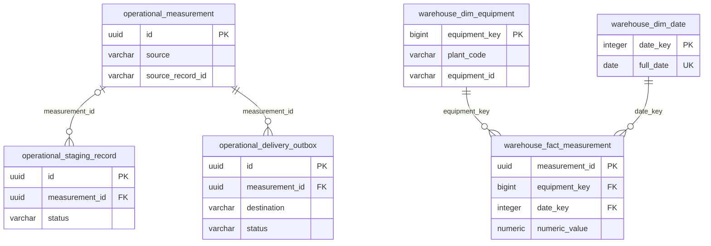

# FactoryBridge Table Schema

這份資料字典描述 **Flyway V2 完成後**的實際結構，供程式閱讀、面試展示與問題追查使用。核對日期：2026-09-22；已對照 migration、讀寫程式及執行中的 PostgreSQL 17 / SQLite metadata。DDL 與後續 migration 是結構的最終依據；本文件不取代 migration，也不是另一份建表腳本。

## 1. 閱讀入口與資料表總覽

| 來源 | 責任 |
| --- | --- |
| [V1 migration](../src/main/resources/db/migration/V1__create_measurement_pipeline.sql) | Operational tables 與原始反正規化 warehouse fact |
| [V2 migration](../src/main/resources/db/migration/V2__create_warehouse_star_schema.sql) | 保留 V1 archive，建立設備／日期維度並調整 fact |
| [架構](architecture.md) / [ADR-010、ADR-012](decisions.md) | 交易邊界、Star Schema 與維度政策的原因 |
| [分析 SQL](../demo/warehouse-analysis.sql) | 三表 JOIN，統計每天每台設備的異常量測筆數 |
| [模擬器](../demo/simulator.py) | 獨立 SQLite 的下游接收紀錄及故障開關 |

| 資料表 | 一列代表什麼 | 寫入者 |
| --- | --- | --- |
| `factorybridge.measurement` | 一筆已接受、標準化的來源量測 | `JpaMeasurementStore` |
| `factorybridge.staging_record` | 一次收件／raw replay 的原文與處理結果 | `JpaStagingStore`、`JpaMeasurementStore` |
| `factorybridge.delivery_outbox` | 一筆量測對一個目的地的交付工作 | `OutboxEnqueuer`、`JdbcDeliveryStore` |
| `warehouse.dim_equipment` | 同一廠區的一台設備，採首次載入屬性 | `JdbcWarehouseWriter`、V2 backfill |
| `warehouse.dim_date` | 一個 UTC 日曆日期 | `JdbcWarehouseWriter`、V2 backfill |
| `warehouse.fact_measurement` | 一筆已成功入倉的量測 | `JdbcWarehouseWriter` |
| `warehouse.fact_measurement_v1_archive` | V2 升級當下的一筆完整 V1 fact | 僅 V2 migration |
| `public.flyway_schema_history` | 一次已記錄的 migration 執行 | Flyway 管理 |
| SQLite `deliveries` | 下游模擬器接受的一個冪等訊息 | `DeliveryLedger` |
| SQLite `settings` | 一個模擬器設定項目 | `DeliveryLedger` |

PostgreSQL database 預設為 `factorybridge`；`factorybridge` 與 `warehouse` 是不同 schema，但共用 cluster、datasource 與連線池。SQLite 位於 simulator 容器 `/data/deliveries.sqlite3`，由 `simulator-data` volume 保存；不是 PostgreSQL 的另一個 schema。

## 2. ERD 與關聯邊界

圖中 `operational_*` 對應 `factorybridge.*`，`warehouse_*` 對應 `warehouse.*`；線條只表示實際 FK。



| 子欄位 | 參照欄位 | 可為 NULL | 關聯語意 |
| --- | --- | --- | --- |
| `staging_record.measurement_id` | `factorybridge.measurement.id` | 是 | 接受／重複收件才關聯 canonical；同一量測可有多次收件 |
| `delivery_outbox.measurement_id` | `factorybridge.measurement.id` | 否 | 每個工作必須屬於已接受的量測 |
| `fact_measurement.equipment_key` | `warehouse.dim_equipment.equipment_key` | 否 | 設備維度可被多筆 fact 共用 |
| `fact_measurement.date_key` | `warehouse.dim_date.date_key` | 否 | 日期維度可被多筆 fact 共用 |

四個 FK 均使用 PostgreSQL 預設 `ON DELETE NO ACTION / ON UPDATE NO ACTION`，沒有 cascading delete。Schema 允許 canonical 暫無 delivery；「接受時一定建立目的地工作」由 application transaction 保證，不是 FK 保證。

`warehouse.fact_measurement.measurement_id = factorybridge.measurement.id` 是寫入器沿用的**邏輯血緣**，沒有跨 schema FK。這讓倉儲不必依賴 operational table 的保留期限；不能只因 ID 相同就假定有資料庫關聯約束。Archive、Flyway 與 SQLite tables 不參與上述 FK 網路。

## 3. 共通欄位慣例

- 欄位表的「可為 NULL」「DB 預設」描述 DDL；`—` 代表沒有欄位 DEFAULT，不代表程式不會提供初始值。
- PostgreSQL UUID 主鍵由程式產生，沒有 UUID DEFAULT。`equipment_key` 是唯一使用 `GENERATED ALWAYS AS IDENTITY` 的鍵；sequence 可以跳號，不能解讀為連續業務編號。
- 業務時間使用 `timestamptz` 與 Java `Instant` 表達同一時間點。顯示格式受 DB session timezone 影響，不保存來源原時區文字；來源原文留在 staging。`measured_at` 在 domain 截斷至微秒。
- `numeric(20,6)` 提供 14 位整數、6 位小數；domain 使用 `BigDecimal`、`HALF_UP` 並檢查容量。DDL 另排除 `NaN`。
- 所有 `varchar` 狀態／代碼都是字串欄位，沒有 PostgreSQL ENUM。DB 只對下列明列的值域設 CHECK。
- 識別碼清洗、來源白名單、物理上下限、UTF-8 與 body 大小屬於程式驗證。欄位長度／NOT NULL 不等於完整業務驗證。

以下 metric / unit 組合由 operational 與 warehouse fact 的 CHECK 共同限制：

| `metric_type` | `standard_unit` |
| --- | --- |
| `TEMPERATURE` | `C` |
| `PRESSURE` | `kPa` |
| `HUMIDITY` | `%` |
| `ROTATIONAL_SPEED` | `rpm` |

`quality_status` 可為 `GOOD`、`WARNING`、`BAD`。後兩者仍是合法量測；格式／單位不合法的原文則留在 staging，不建立 canonical。

## 4. factorybridge.measurement

保存不可變 canonical；business key 為 `(source, source_record_id)`。同設備可在不同時間、批號、metric 留下多筆量測，`equipment_id` 不是此表的 unique key。

| 欄位 | 型別 | 可為 NULL | DB 預設 | 說明 |
| --- | --- | --- | --- | --- |
| `id` | `uuid` | 否 | — | Canonical 主鍵；也作為 warehouse measurement ID |
| `equipment_id` | `varchar(128)` | 否 | — | 設備代碼，應搭配 plant 判讀 |
| `equipment_type` | `varchar(128)` | 是 | — | 當筆量測的設備類型 |
| `plant_code` | `varchar(128)` | 否 | — | 廠區代碼 |
| `line_code` | `varchar(128)` | 否 | — | 當筆量測的產線代碼 |
| `station_code` | `varchar(128)` | 否 | — | 當筆量測的站點代碼 |
| `lot_number` | `varchar(128)` | 是 | — | 批次追溯資訊，保留大小寫 |
| `batch_number` | `varchar(128)` | 是 | — | 生產 batch 識別，保留大小寫 |
| `metric_type` | `varchar(32)` | 否 | — | 標準量測類型，見共通值域 |
| `numeric_value` | `numeric(20,6)` | 否 | — | 已換算至標準單位的數值 |
| `standard_unit` | `varchar(16)` | 否 | — | 必須與 metric 配對 |
| `measured_at` | `timestamptz` | 否 | — | 來源事件時間，非收件時間 |
| `quality_status` | `varchar(16)` | 否 | — | `GOOD` / `WARNING` / `BAD` |
| `source` | `varchar(128)` | 否 | — | 標準來源系統識別 |
| `source_record_id` | `varchar(128)` | 否 | — | 來源記錄 ID，保留大小寫 |
| `payload_hash` | `varchar(64)` | 否 | — | 結構化來源 JSON 的 SHA-256 fingerprint |
| `created_at` | `timestamptz` | 否 | — | 程式提供的接受資料時間 |

| 約束 | 保證 |
| --- | --- |
| `measurement_pkey` | `PRIMARY KEY (id)` |
| `uq_measurement_source_record` | `UNIQUE (source, source_record_id)`，支援並發去重 |
| `measurement_metric_type_check` | 四種標準 metric |
| `measurement_numeric_value_check` | `numeric_value <> 'NaN'::numeric` |
| `measurement_quality_status_check` | 三種品質狀態 |
| `measurement_payload_hash_check` | `payload_hash ~ '^[0-9a-f]{64}$'` |
| `ck_measurement_standard_unit` | metric / unit 配對 |

Fingerprint 對完整來源 JSON 樹排序物件鍵後序列化，不是 canonical hash，也不是 raw bytes hash。同 source key、同 hash 回傳既有 ID；不同 hash 回報 `DUPLICATE_SOURCE_RECORD`，不覆寫量測。不可變性是目前 store / API 契約，沒有 DB trigger 禁止管理者 UPDATE。

## 5. factorybridge.staging_record

先於內容驗證獨立提交原文，使驗證失敗仍能追查。一次 replay 新增一列；沒有 `parent_staging_id` 欄位。`EXTERNAL_RECORD_MISMATCH` 隔離的紀錄不允許 raw replay，須重新 import，以維持原請求的來源身分約束。

| 欄位 | 型別 | 可為 NULL | DB 預設 | 說明 |
| --- | --- | --- | --- | --- |
| `id` | `uuid` | 否 | — | 此次收件主鍵 |
| `raw_payload` | `bytea` | 否 | — | UTF-8 原文 bytes；可包含無效 JSON 或 NUL |
| `correlation_id` | `varchar(128)` | 否 | — | 串接請求、staging 與 delivery log |
| `received_at` | `timestamptz` | 否 | — | FactoryBridge 實際收件時間 |
| `status` | `varchar(16)` | 否 | — | 程式初始寫入 `RECEIVED`，不是 DB DEFAULT |
| `measurement_id` | `uuid` | 是 | — | 已接受／重複量測的 FK |
| `error_code` | `varchar(64)` | 是 | — | 拒絕的穩定語意代碼 |
| `error_message` | `varchar(512)` | 是 | — | 錯誤摘要；程式截斷至欄位上限 |
| `expected_source` | `varchar(128)` | 是 | — | MES pull 原先要求的來源系統 |
| `expected_source_record_id` | `varchar(128)` | 是 | — | MES pull 原先要求的來源記錄 ID |

`staging_record_pkey` 為 `id`；`staging_record_measurement_id_fkey` 指向 canonical。`staging_record_status_check` 限制四種狀態；`ck_staging_expected_identity` 要求兩個 expected 欄位同為 NULL 或同為非 NULL。一般 push 兩者為 NULL，import 則與 raw 同時保存，重跑沿用原條件。

`ck_staging_outcome` 保證下列組合：

| status | measurement_id | error_code |
| --- | --- | --- |
| `RECEIVED` | NULL | NULL |
| `ACCEPTED` / `DUPLICATE` | 非 NULL | NULL |
| `REJECTED` | NULL | 非 NULL |

此 CHECK 不限制 `error_message` 是否為 NULL。狀態轉移由程式限制為 `RECEIVED → ACCEPTED / DUPLICATE / REJECTED`；CHECK 本身不驗證前一狀態。處理中斷或拒絕結果寫入失敗時，可能停在 `RECEIVED`。Raw 不是 `jsonb`，因此不在入庫時要求 JSON 語法有效；transport 邊界仍拒絕非法 UTF-8 或超限 body。

## 6. factorybridge.delivery_outbox

每個 `(measurement_id, destination)` 最多一個工作。所有合法品質送 `DATA_WAREHOUSE`，只有 `GOOD` 另送 `DOWNSTREAM`；路由是 `OutboxEnqueuer` 的政策，DDL 不會自行建立工作。

| 欄位 | 型別 | 可為 NULL | DB 預設 | 說明 |
| --- | --- | --- | --- | --- |
| `id` | `uuid` | 否 | — | 工作主鍵；HTTP 下游的 Idempotency-Key |
| `measurement_id` | `uuid` | 否 | — | 指向 canonical 的 FK |
| `destination` | `varchar(32)` | 否 | — | `DATA_WAREHOUSE` / `DOWNSTREAM` |
| `status` | `varchar(16)` | 否 | — | 程式初始寫入 `PENDING` |
| `attempt_count` | `integer` | 否 | `0` | 本輪認領次數；人工 replay 歸零 |
| `total_attempts` | `integer` | 否 | `0` | 累計認領次數；人工 replay 不歸零 |
| `replay_count` | `integer` | 否 | `0` | 人工重跑次數 |
| `next_attempt_at` | `timestamptz` | 否 | — | 待認領排程時間；首次等於建立時間 |
| `lease_token` | `uuid` | 是 | — | 每次 claim 由 `gen_random_uuid()` 換發；不是欄位 DEFAULT |
| `lease_expires_at` | `timestamptz` | 是 | — | 可被其他 worker 回收的時間門檻 |
| `correlation_id` | `varchar(128)` | 否 | — | 原工作追蹤識別；人工 replay 保留 |
| `last_error_code` | `varchar(64)` | 是 | — | 最近一次已成功記錄的錯誤代碼 |
| `last_error_message` | `varchar(512)` | 是 | — | 最近錯誤摘要；SQL 截斷至 512 字元 |
| `created_at` | `timestamptz` | 否 | — | 程式提供的工作建立時間 |
| `delivered_at` | `timestamptz` | 是 | — | 本機成功 acknowledgement 時間 |

| 約束 | 保證 |
| --- | --- |
| `delivery_outbox_pkey` | `PRIMARY KEY (id)` |
| `delivery_outbox_measurement_id_fkey` | canonical 必須存在 |
| `uq_delivery_destination` | `UNIQUE (measurement_id, destination)` |
| `delivery_outbox_destination_check` | 僅兩種目的地 |
| `delivery_outbox_status_check` | `PENDING` / `IN_FLIGHT` / `RETRY` / `DELIVERED` / `DEAD` |
| `delivery_outbox_attempt_count_check` | `attempt_count >= 0` |
| `delivery_outbox_check` | `total_attempts >= attempt_count` |
| `delivery_outbox_replay_count_check` | `replay_count >= 0` |
| `ck_delivery_lease` | 僅 `IN_FLIGHT` 的兩個 lease 欄位必須同時非 NULL；其他狀態兩者皆 NULL |
| `ck_delivery_completion` | `status = 'DELIVERED'` 等價於 `delivered_at IS NOT NULL` |

| 操作 | 狀態及欄位變化 |
| --- | --- |
| Claim 到期工作 | `PENDING / RETRY → IN_FLIGHT`；兩個 attempt 計數加一、產生新 lease |
| 回收過期 lease | `IN_FLIGHT → IN_FLIGHT`，換新 token，兩個 attempt 計數同樣加一 |
| 成功 acknowledgement | `IN_FLIGHT → DELIVERED`；清 lease / last error，填 delivered_at |
| 失敗 acknowledgement | `IN_FLIGHT → RETRY / DEAD`；清 lease，保存最後錯誤與排程 |
| 人工 replay | 僅 `DEAD → PENDING`；attempt_count 歸零、replay_count 加一、next_attempt_at 更新；其他歷史欄位保留 |

Claim 使用 `FOR UPDATE SKIP LOCKED`；acknowledgement 更新條件為工作 ID、`IN_FLIGHT` 與 token。**過期表示可以回收，不表示時鐘一到舊 token 就自動失效**：SQL 沒有額外檢查 acknowledgement 時刻；另一 worker 換發 token 後，舊 worker 才無法更新。

Attempt 計數不是已發出 HTTP 或已失敗的次數。Claim 可在 I/O 前崩潰，過期回收仍計次；DB 沒有最大次數 CHECK，dispatcher 於失敗回報時判斷重試預算。因此 crash recovery 可能超過 maxAttempts。`DEAD` 雖保留 next_attempt_at，排程器不會自動選取它。此表保存現況與最後錯誤，不是逐次 attempt 的完整稽核表。

## 7. warehouse.dim_equipment

| 欄位 | 型別 | 可為 NULL | DB 預設 | 說明 |
| --- | --- | --- | --- | --- |
| `equipment_key` | `bigint` | 否 | `IDENTITY ALWAYS` | surrogate PK；不可當作業務設備代碼 |
| `equipment_id` | `varchar(128)` | 否 | — | 廠區內的設備代碼 |
| `equipment_type` | `varchar(128)` | 是 | — | 首次入倉時的設備類型 |
| `plant_code` | `varchar(128)` | 否 | — | business key 的廠區部分 |
| `line_code` | `varchar(128)` | 否 | — | 首次入倉時的產線 |
| `station_code` | `varchar(128)` | 否 | — | 首次入倉時的站點 |

`dim_equipment_pkey` 為 `equipment_key`；`uq_dim_equipment_business_key` 為 `(plant_code, equipment_id)`。跨廠同名設備各有一個 key；不同來源系統回報同廠同設備時共用 key，不以 source 拆設備。

Writer 以 `ON CONFLICT DO NOTHING` 保留 **Type 0 首次成功載入屬性**；V2 對既有資料以 `loaded_at, measurement_id` 最早的一筆決定屬性。這不是最新設備主檔，也不代表每筆事件當時位置；DB 沒有禁止 UPDATE 的 trigger。需要設備搬站歷史時，應先定義主檔生效時間，再設計 SCD，不能依到件順序猜測。

## 8. warehouse.dim_date

| 欄位 | 型別 | 可為 NULL | DB 預設 | 說明 |
| --- | --- | --- | --- | --- |
| `date_key` | `integer` | 否 | — | UTC 日期的 YYYYMMDD，例如 20260910 |
| `full_date` | `date` | 否 | — | 完整日曆日期，例如 2026-09-10 |
| `year` | `integer` | 否 | — | 年 |
| `quarter` | `integer` | 否 | — | 季，依 full_date 為 1–4 |
| `month` | `integer` | 否 | — | 月，依 full_date 為 1–12 |
| `day` | `integer` | 否 | — | 月內日期 |

| 約束 | 保證 |
| --- | --- |
| `dim_date_pkey` | `PRIMARY KEY (date_key)` |
| `dim_date_full_date_key` | `UNIQUE (full_date)` |
| `ck_dim_date_key` | `date_key = year * 10000 + month * 100 + day` |
| `ck_dim_date_attributes` | year / quarter / month / day 都等於對 full_date 的 EXTRACT 結果 |

日期按 `measured_at` 的 **UTC 日界線**建立，不按 loaded_at，也不依 server default timezone。例如 `2026-09-11T00:30:00+08:00` 歸入 `20260910`。Writer 使用 `ZoneOffset.UTC`，migration 使用 `AT TIME ZONE 'UTC'`；正式製造環境通常應依 **Plant Business Timezone** 建立日期維度。目前只建立出現過的量測日期，不預填完整日曆，沒有班別、假日或產能日曆。

## 9. warehouse.fact_measurement

一筆 fact 對應一筆成功入倉的 canonical。只保留維度鍵及量測／來源資訊，不重複保存設備、廠區、產線、站點或 lot / batch。

| 欄位 | 型別 | 可為 NULL | DB 預設 | 說明 |
| --- | --- | --- | --- | --- |
| `measurement_id` | `uuid` | 否 | — | PK；沿用 canonical ID，支援冪等重送 |
| `equipment_key` | `bigint` | 否 | — | FK → dim_equipment |
| `date_key` | `integer` | 否 | — | FK → dim_date |
| `metric_type` | `varchar(32)` | 否 | — | 標準量測類型 |
| `numeric_value` | `numeric(20,6)` | 否 | — | Canonical 數值，不再次換算 |
| `standard_unit` | `varchar(16)` | 否 | — | 標準單位 |
| `measured_at` | `timestamptz` | 否 | — | 原量測時間點 |
| `quality_status` | `varchar(16)` | 否 | — | `GOOD` / `WARNING` / `BAD` |
| `source` | `varchar(128)` | 否 | — | 來源系統 |
| `source_record_id` | `varchar(128)` | 否 | — | 來源記錄識別 |
| `loaded_at` | `timestamptz` | 否 | `CURRENT_TIMESTAMP` | 首次入倉交易的起始時間；不是 acknowledgement 時間 |

| 約束 | 保證 |
| --- | --- |
| `fact_measurement_pkey` | `PRIMARY KEY (measurement_id)` |
| `fk_fact_equipment` | 設備維度必須存在 |
| `fk_fact_date` | 日期維度必須存在 |
| `fact_measurement_metric_type_check` | 四種標準 metric |
| `fact_measurement_numeric_value_check` | 排除 NaN |
| `fact_measurement_quality_status_check` | 三種品質狀態 |
| `ck_fact_standard_unit` | metric / unit 配對 |

此表**沒有** `(source, source_record_id)` unique constraint；冪等鍵是 measurement ID。`date_key` 與 measured_at 的 UTC 日期一致由 writer / migration 維護，FK 本身只驗證日期列存在。V2 的 ALTER 不重排物理欄位；上表依閱讀目的排序，直接 `SELECT *` 時鍵欄位位於後方。

Writer 在同一 `REQUIRES_NEW`、`READ_COMMITTED` 交易取得／建立兩個維度，再以 `ON CONFLICT (measurement_id) DO NOTHING` 寫 fact。維度或 fact 失敗一起回滾，錯誤映射為 `DATA_WAREHOUSE_WRITE_FAILED`。重送不改寫 fact 或 loaded_at；warehouse 提交與 outbox acknowledgement 分開，仍屬 at-least-once delivery。

## 10. warehouse.fact_measurement_v1_archive

V2 使用 `CREATE TABLE ... AS SELECT *` 完整保留當時 V1 fact。**CTAS 只保留欄位型別與資料，不繼承 PK、FK、UNIQUE、CHECK、NOT NULL、DEFAULT 或 index。** 下表全部可為 NULL，描述的是 archive 的實際 DDL；快照中的既有值仍來自受 V1 約束的資料。

| 欄位 | 型別 | 可為 NULL | DB 預設 | 說明 |
| --- | --- | --- | --- | --- |
| `measurement_id` | `uuid` | 是 | — | 原量測 ID；archive 沒有 PK |
| `equipment_id` | `varchar(128)` | 是 | — | 每筆原設備代碼 |
| `equipment_type` | `varchar(128)` | 是 | — | 每筆原設備類型 |
| `plant_code` | `varchar(128)` | 是 | — | 每筆原廠區 |
| `line_code` | `varchar(128)` | 是 | — | 每筆原產線 |
| `station_code` | `varchar(128)` | 是 | — | 每筆原站點 |
| `lot_number` | `varchar(128)` | 是 | — | V1 原 lot |
| `batch_number` | `varchar(128)` | 是 | — | V1 原 batch |
| `metric_type` | `varchar(32)` | 是 | — | 原 metric |
| `numeric_value` | `numeric(20,6)` | 是 | — | 原數值 |
| `standard_unit` | `varchar(16)` | 是 | — | 原單位 |
| `measured_at` | `timestamptz` | 是 | — | 原量測時間 |
| `quality_status` | `varchar(16)` | 是 | — | 原品質 |
| `source` | `varchar(128)` | 是 | — | 原來源 |
| `source_record_id` | `varchar(128)` | 是 | — | 原來源記錄 |
| `loaded_at` | `timestamptz` | 是 | — | 原入倉時間；未繼承 CURRENT_TIMESTAMP |

它是一次性升級快照，新版 writer 不寫入、分析 query 不讀取。Fresh DB 跑 V1 → V2 後此表為空；既有 volume 則保留舊資料。不可稱為自動備份、唯讀權限隔離或持續事件稽核；資料庫沒有特別禁止修改此表，亦尚未實作保留期限／清理流程。

## 11. 索引清單與查詢用途

PostgreSQL PK／UNIQUE 自動建立的 B-tree index 與約束同名，不需要再建立重複 index。FK 本身不自動建立子表 index。

| 資料表 | PK / UNIQUE index |
| --- | --- |
| `factorybridge.measurement` | `measurement_pkey`；`uq_measurement_source_record` |
| `factorybridge.staging_record` | `staging_record_pkey` |
| `factorybridge.delivery_outbox` | `delivery_outbox_pkey`；`uq_delivery_destination` |
| `warehouse.dim_equipment` | `dim_equipment_pkey`；`uq_dim_equipment_business_key` |
| `warehouse.dim_date` | `dim_date_pkey`；`dim_date_full_date_key` |
| `warehouse.fact_measurement` | `fact_measurement_pkey` |
| `warehouse.fact_measurement_v1_archive` | 無 |

以下為額外建立的 B-tree index；未標方向者為 ASC：

| Schema / table | Index | 欄位與條件 | 用途 |
| --- | --- | --- | --- |
| `factorybridge.measurement` | `ix_measurement_created` | `(created_at DESC, id DESC)` | 最近量測穩定排序 |
| `factorybridge.measurement` | `ix_measurement_equipment_time` | `(equipment_id, measured_at DESC)` | 按設備代碼與時間查詢；不代表 equipment_id 全域唯一，跨廠查詢仍須 plant 條件 |
| `factorybridge.staging_record` | `ix_staging_received` | `(received_at DESC, id DESC)` | 收件追查；目前未提供 staging 清單 API |
| `factorybridge.staging_record` | `ix_staging_correlation` | `(correlation_id)` | 按請求追查 |
| `factorybridge.delivery_outbox` | `ix_outbox_due` | `(next_attempt_at, id)`，僅 `status IN ('PENDING','RETRY')` | 尋找到期工作 |
| `factorybridge.delivery_outbox` | `ix_outbox_expired_lease` | `(lease_expires_at, id)`，僅 `status = 'IN_FLIGHT'` | 尋找可回收 lease |
| `factorybridge.delivery_outbox` | `ix_outbox_measurement` | `(measurement_id, created_at, id)` | 量測的目的地工作清單 |
| `warehouse.fact_measurement` | `ix_fact_date_equipment` | `(date_key, equipment_key)` | 按日期與設備的分析存取 |
| `warehouse.fact_measurement` | `ix_fact_equipment_time` | `(equipment_key, measured_at DESC)` | 單設備時間序列及設備 FK 存取 |

V1 的 `warehouse.ix_fact_plant_time` 已由 V2 移除。Staging 的 measurement_id 沒有專用 index；目前 API 不提供從量測反查全部 staging 的清單。索引表只描述現有結構，不承諾所有 JOIN / GROUP BY 都會採 index；應以實際資料量與 `EXPLAIN` 判斷。

## 12. public.flyway_schema_history

此表由 Flyway 建立，非 V1 / V2 內的業務表。下表是目前 PostgreSQL 環境的實際結構；日後 Flyway 版本變更時需重新核對，不應手動修改 history 或 checksum。

| 欄位 | 型別 | 可為 NULL | DB 預設 | 說明 |
| --- | --- | --- | --- | --- |
| `installed_rank` | `integer` | 否 | — | 執行排序 PK |
| `version` | `varchar(50)` | 是 | — | migration 版本；目前為 1、2 |
| `description` | `varchar(200)` | 否 | — | migration 說明 |
| `type` | `varchar(20)` | 否 | — | migration 類型 |
| `script` | `varchar(1000)` | 否 | — | migration 檔名 |
| `checksum` | `integer` | 是 | — | Flyway migration checksum，非 payload hash |
| `installed_by` | `varchar(100)` | 否 | — | 執行資料庫使用者 |
| `installed_on` | `timestamp without time zone` | 否 | `now()` | Flyway 建立的技術時間欄位，不是業務 Instant 欄位 |
| `execution_time` | `integer` | 否 | — | 執行耗時，毫秒 |
| `success` | `boolean` | 否 | — | 執行結果 |

PK / unique index 為 `flyway_schema_history_pk`，欄位為 `(installed_rank)`；另有非 unique B-tree `flyway_schema_history_s_idx`，欄位為 `(success)`。`spring.flyway.default-schema=public` 固定 history 位置，避免同名 DB 使用者／schema 在第二次啟動改變 search_path 解析結果。

## 13. 模擬器 SQLite 附錄

SQLite 由 `DeliveryLedger` 啟動時建立，不受 Flyway 管理。下列表沒有 FK、CHECK 或欄位 DEFAULT；主鍵提供非 NULL key 的唯一性，沒有額外業務 index。

### deliveries

| 欄位 | 型別 | 可為 NULL | DB 預設 | 說明 |
| --- | --- | --- | --- | --- |
| `idempotency_key` | `TEXT` | 是 | — | TEXT PK；正常 HTTP 請求使用 outbox UUID |
| `payload_hash` | `TEXT` | 否 | — | 完整 wire bytes 的 SHA-256 |
| `payload` | `TEXT` | 否 | — | UTF-8 JSON 字串；不是 PostgreSQL JSON 型別 |
| `correlation_id` | `TEXT` | 否 | — | 請求追蹤識別 |
| `received_at` | `TEXT` | 否 | — | Python 產生的 UTC ISO 時間字串 |

`BEGIN IMMEDIATE` 將去重檢查與接收紀錄放在同一交易。故障模式關閉時，同 key / 同 hash 回 200 duplicate，同 key / 不同 hash 回 409，首次寫入回 201；故障模式開啟時，會在去重檢查前回 503。此處 hash 針對 wire bytes；與 canonical 的結構化 JSON fingerprint 是不同契約。

### settings

| 欄位 | 型別 | 可為 NULL | DB 預設 | 說明 |
| --- | --- | --- | --- | --- |
| `name` | `TEXT` | 是 | — | TEXT PK，目前僅使用 failure_mode |
| `value` | `TEXT` | 否 | — | 程式寫入字串 true / false |

啟動時 `INSERT OR IGNORE` 建立 `failure_mode = 'false'`，這是初始化資料而非欄位 DEFAULT；重啟保留既有設定。開啟故障時模擬下游回 503。

**SQLite 特例：** 這兩張表不是 STRICT / WITHOUT ROWID，TEXT PK 也沒有明寫 NOT NULL，因此 `PRAGMA table_info` 的 PK 欄位 `notnull=0`，資料庫允許 NULL。不能把 PostgreSQL「PK 必為 NOT NULL」直接套用。正常 API 會驗證 Idempotency-Key，settings key 由程式固定；本文件如實記錄 DDL，不將 application 驗證誤寫為 DB 約束。

## 14. 寫入順序、升級與保留政策

| 階段 | 交易與結果 |
| --- | --- |
| 收件 | 獨立提交 staging raw + expected identity |
| 接受 | canonical + 目的地 outbox + staging outcome 一起提交；失敗一起回滾 |
| 拒絕 | 獨立更新仍為 RECEIVED 的 staging，不刪 raw |
| 倉儲 | equipment / date / fact 在獨立交易一起提交；之後才更新 outbox acknowledgement |
| 下游 | SQLite 去重與接收紀錄一起提交；之後 FactoryBridge 才更新 outbox |

V1 建立 operational 三表與反正規化 fact。V2 在單一 Flyway transaction 內鎖住 fact、完整 CTAS 封存、建立與回填維度、補齊 fact FK / NOT NULL、移除 dimension attribute 與 lot / batch、替換 index。任一步失敗一起回滾；既有 measurement_id、數值、來源、品質與時間保留。V1 檔案及 checksum 不修改。

舊 writer 不相容 V2 欄位，升級需先停止舊 app，再保留 volume 啟動新版；不是零停機部署。步驟見 [README](../README.md)。目前沒有自動刪除、分割表、retention job、完整 attempt event log 或 SCD Type 2；不要以刪除去重鍵來重跑工作。正式場域的 raw、archive、下游去重鍵保留期限需要一起訂定。

## 15. 可直接執行的唯讀核對

在 repository 根目錄，已啟動 Compose 後進入 psql：

```sh
docker compose exec postgres psql -U factorybridge -d factorybridge
```

以下為 psql meta-command：

```text
\dt factorybridge.*
\dt warehouse.*
\d+ factorybridge.measurement
\d+ factorybridge.staging_record
\d+ factorybridge.delivery_outbox
\d+ warehouse.dim_equipment
\d+ warehouse.dim_date
\d+ warehouse.fact_measurement
\d+ warehouse.fact_measurement_v1_archive
\d+ public.flyway_schema_history
```

核對 migration 與 FK；查詢只讀 catalog，不修改 schema 或資料：

```sql
SELECT version, description, success
FROM public.flyway_schema_history
ORDER BY installed_rank;

SELECT conrelid::regclass AS child_table, conname,
       pg_get_constraintdef(oid) AS definition
FROM pg_constraint
WHERE contype = 'f'
  AND connamespace IN ('factorybridge'::regnamespace, 'warehouse'::regnamespace)
ORDER BY conrelid::regclass::text, conname;
```

實際業務分析使用版本控制中的同一份 SQL：

```sh
docker compose exec -T postgres psql -v ON_ERROR_STOP=1 \
  -U factorybridge -d factorybridge < demo/warehouse-analysis.sql
```

該查詢 JOIN Fact → Equipment / Date，僅計算已入倉的 WARNING / BAD；不輸出零筆異常組合，不把筆數當故障次數或異常率。相關測試入口為 [WarehousePersistenceIT](../src/test/java/io/factorybridge/adapter/persistence/WarehousePersistenceIT.java)、[WarehouseMigrationIT](../src/test/java/io/factorybridge/adapter/persistence/WarehouseMigrationIT.java)，歷次實測見 [verification.md](verification.md)。新增 migration 時，應同步更新本文件的欄位、約束、索引與核對版本。
